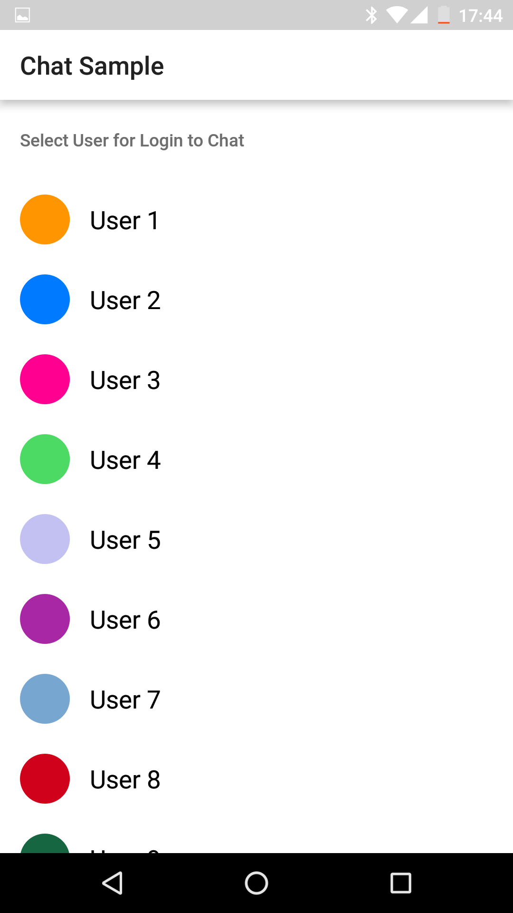
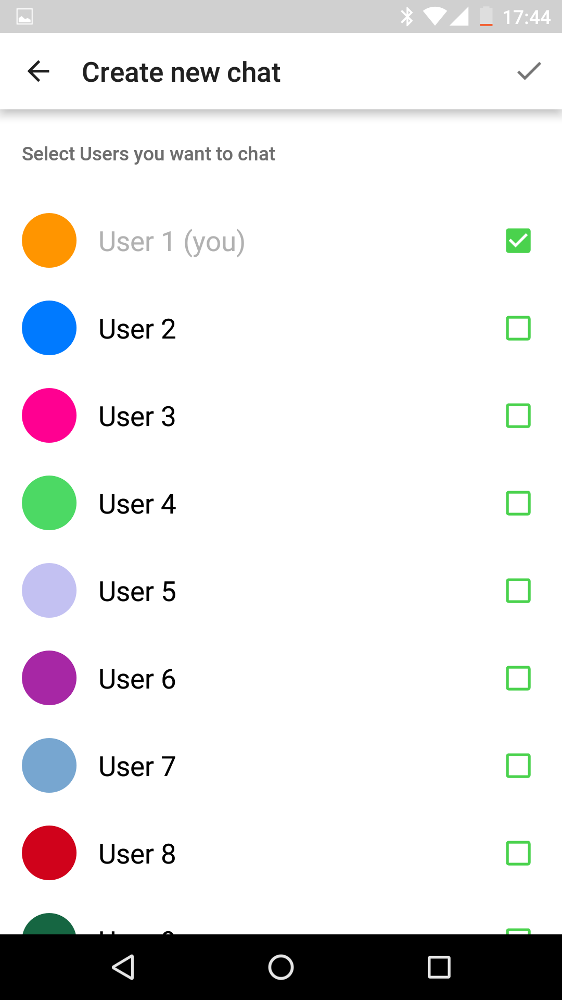
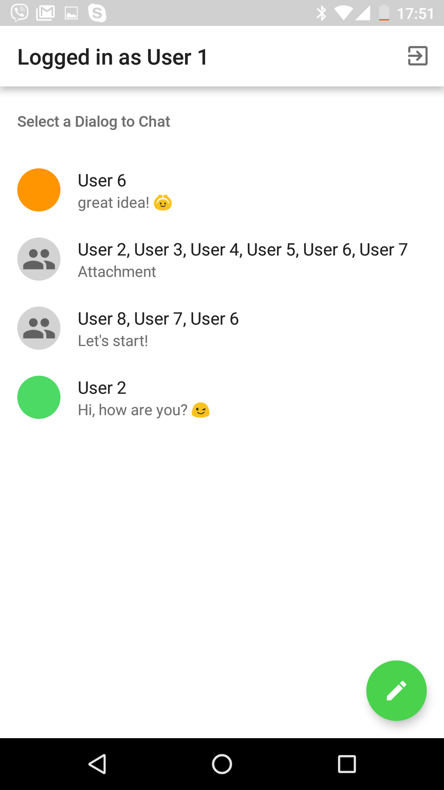
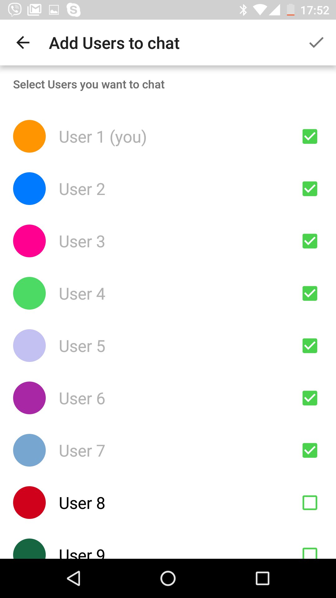

# Overview
Android Chat on a Java with using [ Android QuickBlox SDK](https://docs.quickblox.com/docs/android-quick-start)

# Application features:

1. Authenticate with Quickblox Chat and REST.
2. Receive and display list of dialogs.
3. Modify dialog by adding occupants.
4. Real-time chat messaging and attachment's handling.
5. Receiving Push-notifications from server in background

# Added functionality
[In origin project of Android chat](https://github.com/QuickBlox/quickblox-android-sdk/tree/master/sample-chat-java) was added [Room persistence library](https://developer.android.com/training/data-storage/room) as a local storage for **User** and **Dialog** entity.

# Minimum Supported Version of Android
    - 7.0 (Nougat)

# Instruction how to run application

## Get application credentials

QuickBlox application includes everything that brings messaging right into your application - chat, video calling, users, push notifications, etc. To create a     QuickBlox application, follow the steps below:

  1.Register a new account following [this link](https://admin.quickblox.com/signup). Type in your email and password to sign in. You can also sign in with your Google or Github accounts.
  2.Create the app clicking **New app** button.
  3.Configure the app. Type in the information about your organization into corresponding fields and click **Add** button.
  4.Go to **Dashboard => _YOUR_APP_ => Overview** section and copy your **Application ID**, **Authorization Key**, **Authorization Secret**, and **Account Key**.

## Clone project, paste credentials and run application

1.Clone the repository using the link below:

    git clone https://github.com/QuickBlox/quickblox-android-sdk.git

  2.Go to menu **File => Open Project**. (Or "Open an existing Project" if Android Studio is just opened)
  3.Select a path to the sample.
  4.Select **Use default gradle wrapper** (recommended) and click **OK**.
  5.Open **App.java**
     *//src/main/java/com/quickblox/sample/chat/java/App.java*
     and paste the credentials into the values of constants.

    private static final String APPLICATION_ID = "";
    private static final String AUTH_KEY = "";
    private static final String AUTH_SECRET = "";
    private static final String ACCOUNT_KEY = "";

  7.Run the code in IDE or on real device.

# Have questions or found issue
Please contact with Viktor Skibnev (e-mail: v.skibnev@gmail.com)

# Screenshots

